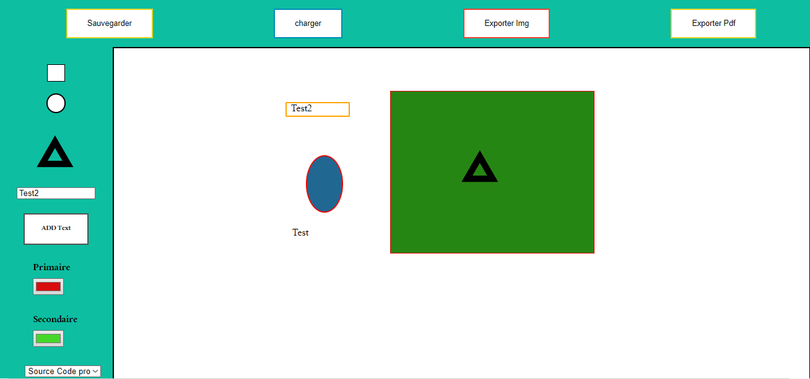

### 
 ServicePaint • 

### 1. Description

Project paint is as the application paint so we can draw triangles, circles, boxes add a text, use colors and change font family 

### 2. Why?
Our school Hetic gave as a Fullstack project for 4 days to make a Fullstack game using various languages : php, javascript and css.

### 3. Team members 
[Dridi Mohamed Amine](https://github.com/dridi19):  
[Gouja]  
[Rogier]  
[Rekik]  
[Ghazal]  

### 3. Possible improvements:
Design of the interface.  
Resize of the text.  

### 4. What we learned: 
Coding improvements  
use eventleasteners javascript
